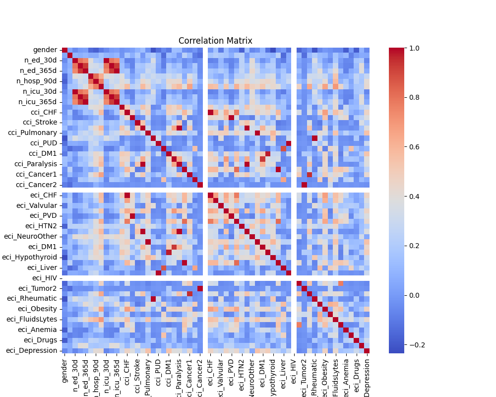
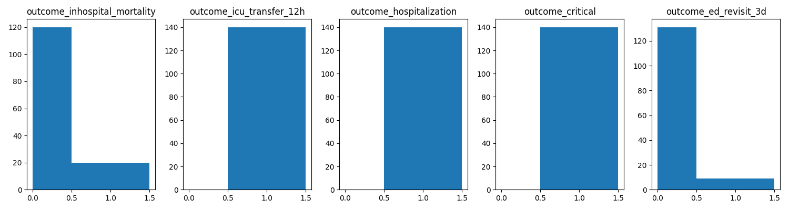
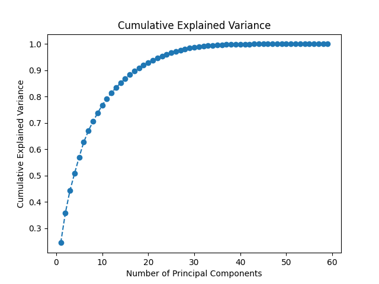
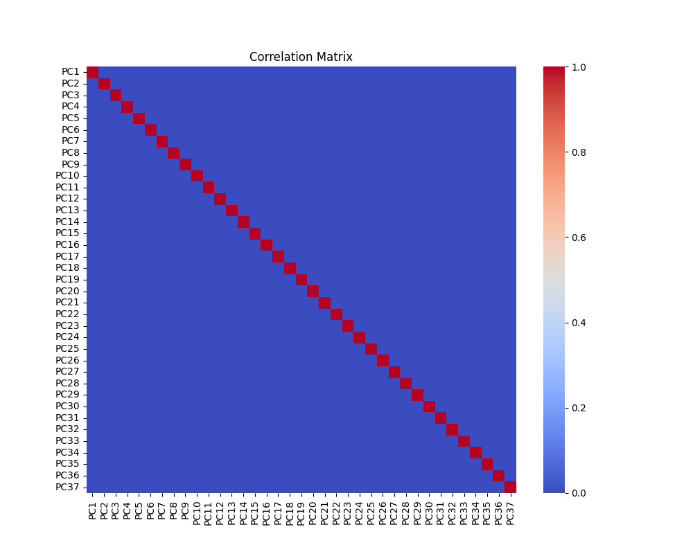

# EHR Data Analysis and outcome prediction with Deep Learning


[![PyPI Version][pypi-image]][pypi-url]
[![Build Status][build-image]][build-url]
[![Code Coverage][coverage-image]][coverage-url]


<!-- Badges: -->

[pypi-image]: https://img.shields.io/pypi/v/deepehrgraph
[pypi-url]: https://pypi.org/project/deepehrgraph/
[build-image]: https://github.com/fco-dv/deep-ehr-graph/actions/workflows/build.yaml/badge.svg
[build-url]: https://github.com/fco-dv/deep-ehr-graph/actions/workflows/build.yaml
[coverage-image]: https://codecov.io/gh/fco-dv/deep-ehr-graph/branch/main/graph/badge.svg
[coverage-url]: https://codecov.io/gh/fco-dv/deep-ehr-graph/

## Description
This project aims at demonstring deep learning methodologies for EHR data. 
The use case is to predict different outcomes for patients in the ICU.
The dataset is from [MIMIC-IV demo](https://physionet.org/content/mimic-iv-demo/2.2/) containing de-identified health-related data from 140 patients admitted to critical care units. 

## Installation
### Install the latest package version with pip
```bash
pip3 install -U deepehrgraph
```
### Commands
Display available subcommands:
```bash
python3 -m deepehrgraph.main --help
```

## Dataset
The full dataset description can be found [mimic iv demo dataset](https://physionet.org/content/mimic-iv-demo/2.2/).

It contains de-identified health-related data from 140 patients admitted to critical care units. The data includes demographics, vital signs, laboratory tests, medications, and more. The data is stored in a relational database, and the schema is described in the [MIMIC-IV documentation](https://mimic.mit.edu/docs/iv/).

Note that we only have access to the [hosp](https://mimic.mit.edu/docs/iv/modules/hosp/) and [icu](https://mimic.mit.edu/docs/iv/modules/icu/) compressed files
regarding this demo.

### Generate main dataset from compressed files

```bash
python -m deepehrgraph.main dataset
```

This step will download the archive files from physionet and generate the master dataset in the `data` folder by default as a csv file called `mimic_iv_demo_master_dataset.csv`.


Several pre-computation steps are done in order to generate this master dataset:
- CCI and ECI indexes are calculated and added to the dataset.
- Outcomes for patients are calculed and added to the date.


These pre-computations have been adapted from this [repository](https://github.com/nliulab/mimic4ed-benchmark) specifically for the MIMIC-IV demo dataset.

Categorical features are identified and encoded with [LabelEncoder](https://scikit-learn.org/stable/modules/generated/sklearn.preprocessing.LabelEncoder.html).

In the context of medical studies, CCI (Charlson Comorbidity Index) and ECI (Elixhauser Comorbidity Index) are tools used to assess the burden of comorbidities in individuals.
Comorbidities refer to the presence of additional health conditions in a patient alongside the primary condition under investigation. Both CCI and ECI are designed to quantify and summarize the impact of comorbidities on patient health. **These features seem to be good candidates for our prediction task.**


### EDA : Features and outcomes analysis
Run simple EDA with this command and you will get:
-  basic information about dataset datatypes
-  missing values count
-  correlation matrix
-  outcomes distribution

```bash
python -m deepehrgraph.main eda
```

`Correlation Matrix`



Here are the 25 top correlated features:
```
| Variable1        | Variable2        | Correlation |
|------------------|------------------|-------------|
| cci_Renal        | eci_Renal        | 1.000000    |
| cci_Rheumatic    | eci_Rheumatic    | 1.000000    |
| n_ed_365d        | n_icu_365d       | 1.000000    |
| cci_Cancer2      | eci_Tumor2       | 1.000000    |
| cci_Paralysis    | eci_Paralysis    | 1.000000    |
| n_ed_30d         | n_icu_30d        | 1.000000    |
| cci_PUD          | eci_PUD          | 1.000000    |
| n_ed_90d         | n_icu_90d        | 1.000000    |
| cci_Pulmonary    | eci_Pulmonary    | 1.000000    |
| cci_CHF          | eci_CHF          | 1.000000    |
| cci_Dementia     | cci_Paralysis    | 1.000000    |
| cci_PVD          | eci_PVD          | 1.000000    |
| cci_Dementia     | eci_Paralysis    | 1.000000    |
| cci_DM1          | eci_DM2          | 0.971825    |
| cci_Cancer1      | eci_Tumor1       | 0.949788    |
| cci_DM2          | eci_DM1          | 0.931891    |
| n_icu_90d        | n_icu_365d       | 0.927516    |
| n_ed_90d         | n_icu_365d       | 0.927516    |
| n_ed_365d        | n_icu_90d        | 0.927516    |
| n_ed_90d         | n_ed_365d        | 0.927516    |
| cci_Liver1       | eci_Liver        | 0.875261    |
| eci_HTN1         | eci_Renal        | 0.815725    |
| cci_Renal        | eci_HTN1         | 0.815725    |
| n_hosp_30d       | n_hosp_90d       | 0.807012    |
| n_ed_30d         | n_ed_90d         | 0.795026    |
```

Some features are highly correlated which could lead to poor model performance:
- instability that make difficult to interpret the individual impact of each variable on the target.
- model instability, increased sensitivity to small changes in the data
- overfitting

We will try to address this situation by using features selection technique.

`Outcomes Repartition`


Based on these first results we will try to predict the following outcome: `in-hospital mortality`. 
Note that we are facing an outcome class imbalance problem which can result in poor results while trying to predict this outcome, we will need to add a pre-processing for that on the traning set.

## PCA for Collinear Feature Reduction

This command will run the features selection code:
- display cumulative explained variance
- display correlation matrix of the PCA result features
- return number of features to keep

```bash
python -m deepehrgraph.main feat_select
```

### Overview

Principal Component Analysis (PCA) is a technique for reducing the dimensionality of your dataset while retaining most of its original information. It's particularly useful for handling collinear features and improving model performance.

### Understanding Cumulative Variance

- **Explained Variance Ratio:**
  - Each principal component explains a certain proportion of the total variance. The cumulative explained variance is the sum of these individual variances, representing the overall information retained.

- **Choosing Components:**
  - Decide on the number of components based on the desired cumulative explained variance (e.g., 95%). This choice balances dimensionality reduction with information preservation.

`Cumulative Explained Variance`


### Expectations for Final Correlation Matrix

- **Correlation Among Features:**
  - The final correlation matrix of the PCA result features ideally shows reduced correlations between features. Principal components are designed to be orthogonal, minimizing multicollinearity.

- **Near-Zero Correlations:**
  - Aim for near-zero correlations in the PCA result features, indicating that each component captures unique information.

`Correlation Matrix PCA`


**37 features will be selected for training the model.** This number is based on the cumulative explained variance of 95%.

## Model architecture

The `BinaryClassificationModel` is a simple neural network designed for binary classification tasks. It utilizes the PyTorch framework for building and training neural networks.


### Initialization
The model is initialized with the following parameters:
- `input_size`: Number of features in the input data.
- `hidden_size`: Number of neurons in the hidden layer.
- `output_size`: Number of neurons in the output layer (typically 1 for binary classification).

### Layers
1. **Layer 1 (`self.layer1`):**
   - Type: Linear (Fully Connected) Layer
   - Input: `input_size`
   - Output: `hidden_size`
   - Activation Function: None (linear transformation)

2. **ReLU Activation (`self.relu`):**
   - Type: Rectified Linear Unit (ReLU)
   - Activation Function: ReLU
   - Introduces non-linearity to the model.

3. **Layer 2 (`self.layer2`):**
   - Type: Linear Layer
   - Input: `hidden_size`
   - Output: `output_size`
   - Activation Function: None (linear transformation)

4. **Sigmoid Activation (`self.sigmoid`):**
   - Type: Sigmoid Activation
   - Activation Function: Sigmoid
   - Converts the output to a probability between 0 and 1, suitable for binary classification.

`input_size` will correspond to the number of previsouly selected PCA features.

## Training

[Pytorch Lightning](https://github.com/Lightning-AI/lightning) is used as a framework for training the model. It provides a high-level interface for PyTorch that abstracts away the boilerplate code needed for training and validation. Here are some of the features that Pytorch Lightning provides and that are used in this code:
- Automatic GPU/CPU device placement
- Automatic training and validation loop
- Automatic checkpointing
- Automatic logging

In order to run the training, you can use the following command:

```bash
python -m deepehrgraph.main train --max-epochs 30
```

Models are saved in:
- `./models/checkpoints` for checkpoints
- `./models/production` for the best model according to validation loss metric as torchscript file

After the training the logs are available via tensorboard wtih the following command:

```bash
 tensorboard --logdir=./tb_logs       
```

Here is the implemented methodology:

 ### Features Selection
We are using the PCA technique to reduce the number of features and address the collinearity problem.
We are keeping the 37 first components that explain 95% of the variance.

### Data Split and Oversampling
The dataset is split into train and validation sets with a 80/20 ratio.
The train set is oversampled to address the class imbalance problem for the `outcome_inhospital_mortality`.

### Loss Function
We are using the Binary Cross Entropy Loss function for this binary classification task.

### Optimizer
We are using the Adam optimizer for this task with standard parameter.

### Metrics
We are using the following metrics to evaluate the model performance for both train and validation sets:
- Loss
- Accuracy
- Precision
- Recall
- F1 Score

## Resources
- https://physionet.org/content/mimic-iv-demo/2.2/
- https://mimic.mit.edu/docs/iv/modules/hosp/
- https://mimic.mit.edu/docs/iv/modules/icu/
- https://www.sciencedirect.com/science/article/pii/S2352914823001089
- https://github.com/healthylaife/MIMIC-IV-Data-Pipeline#How-to-use-the-pipeline
- https://scikit-learn.org/stable/common_pitfalls.html


## Contributing
### Install dependencies
```bash
pip3 install poetry
poetry install
```
### Pre-commit hooks
```bash
poetry run pre-commit install
```
Run pre-commit hooks on all files
```bash
poetry run pre-commit run --all-files
```
### Run tests
Tox is using pre-commit hooks to run tests and linting.
```bash
cd deep-ehr-graph
tox .
```
